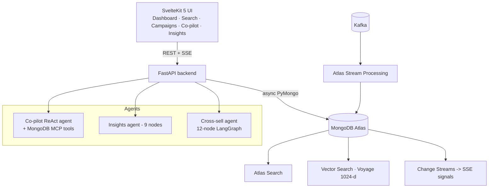

<!-- Portfolio repository -->

> **Retail Customer 360 Platform** — portfolio demonstration.
> SvelteKit + FastAPI + Atlas Search, Vector Search, streaming, and agent memory
>
> This is a sanitized public version of a real-world prototype. Client names,
> credentials, internal endpoints, and proprietary assets have been removed; all
> configuration is environment-driven (`.env.example`). Authored by
> [Paul Cleenewerck](https://github.com/pcleene).

---

# Retail Customer 360 — Customer Intelligence Platform

> A working demo that shows how a **single MongoDB Atlas cluster** can power an
> entire modern Customer-360 stack: operational data, full-text search,
> vector / semantic search, streaming ingestion, real-time signals, agent
> memory, and natural-language analytics — without bolting on a separate
> search engine, vector DB, message-bus consumer, or memory store.

Built around a fictional Malaysian retail group ("RetailGroup Group") with three
business entities — **RetailGroup Co** (retail), **RetailGroup Credit** (financing),
**RetailGroup Bank** (digital bank) — and ~50 K customers, ~2 M transactions,
~500 K products.

---

## 1. Why this demo exists

Most "Customer 360 + AI" architectures end up with **5–7 separate
systems**:

| Capability                   | Typical stack                    | In Retail Customer 360       |
| ---------------------------- | -------------------------------- | ----------------- |
| Operational store            | Postgres / MySQL                 | **MongoDB Atlas** |
| Full-text search             | Elasticsearch / OpenSearch       | **MongoDB Atlas** |
| Vector / semantic search     | Pinecone / Weaviate / pgvector   | **MongoDB Atlas** |
| Stream processing (Kafka)    | Flink / Spark / kSQL             | **MongoDB Atlas** |
| CDC / event-driven triggers  | Debezium + Kafka + consumers     | **MongoDB Atlas** |
| Agent short-term memory      | Redis / Postgres                 | **MongoDB Atlas** |
| Agent long-term memory (RAG) | Vector DB + relational metadata  | **MongoDB Atlas** |
| Time-series / KPI rollups    | Influx / TimescaleDB             | **MongoDB Atlas** |

> **Everything in this repo runs against one Atlas cluster, one query
> language (MQL), one driver, one set of credentials.**

That collapse is the whole point. The AI capabilities you'll see — agent
chat, vector search, RAG, real-time signals, streaming ingestion — are
not bolted onto the data platform. They _are_ the data platform.

---

## 2. What you can see and click

The frontend is a SvelteKit 5 app at <http://localhost:5173>, with five
production-style pages:

| Page             | What it demonstrates                                                                     | MongoDB feature in play                                          |
| ---------------- | ---------------------------------------------------------------------------------------- | ---------------------------------------------------------------- |
| **Dashboard**    | Live KPI tiles, charts, real-time cross-sell signal stream                               | Aggregation framework, **Change Streams**, SSE                   |
| **Client Search**| Hybrid search over 50 K customers — text + filters + semantic relevance                  | **Atlas Search** + **Atlas Vector Search** + `$rankFusion`       |
| **Campaigns**    | Campaign catalog with vector-matched audiences and actions                               | Atlas Vector Search, aggregation                                 |
| **Co-pilot**     | Natural-language analytics chat — agent talks to MongoDB via **MCP**                     | **MongoDB MCP Server**, `MongoDBSaver`, `MongoDBStore` (memory)  |
| **Insights**     | Role-aware (RBAC) analytics chat — supplier / partner / staff see different scopes       | Aggregation, vector search, RBAC injection at pipeline level     |

Every JSON response includes a `_queries` block — middleware automatically
captures the actual MQL each request issued and surfaces it in the UI's
**Query Inspector**, so visitors can _see_ the queries running underneath.

There's also a small floating **Architecture** modal (bottom-right) that
explains the layers visually.

---

## 3. The MongoDB value, concretely

This is the bit you want to read before a customer call.

### 3.1 One database, every workload

The same documents in `customers` are used for:

- Transactional reads/writes (PyMongo).
- Full-text + faceted search (`$search`, Atlas Search index `customers_search`).
- Semantic search (`$vectorSearch`, Voyage AI 1024-dim embeddings on
  `customers_vector`).
- **Hybrid search** combining the two via `$rankFusion`.
- Change-stream-driven real-time signals (`cross_sell_signals` watcher).
- Aggregation analytics for the dashboard and insights agent.

No ETL. No reverse-ETL. No "vector database alongside the source of truth".
The vector lives _on the document_, indexed by the same cluster that owns
the data.

### 3.2 Atlas Search + Vector Search + `$rankFusion`

`backend/services/customer_service/search.py` is a single hybrid search
function. It builds an Atlas Search query (filters, facets, scoring), a
vector search query (Voyage AI embedding of the user's text), and merges
them with `$rankFusion` — Atlas's native multi-retriever ranking stage.
Falls back gracefully to vector-only or text-only if needed.

**Why customers care:** they don't need to stand up Elasticsearch + a
vector DB and figure out fusion themselves. One pipeline, one index
config, one place to debug.

### 3.3 Atlas Stream Processing (ASP)

`backend/stream_processing/*.js` contains five ASP pipelines that consume
from Google Managed Kafka and write into MongoDB:

| Pipeline                 | Job                                                            |
| ------------------------ | -------------------------------------------------------------- |
| `event_ingest.js`        | Validates raw transaction events from Kafka → `transactions`  |
| `realtime_kpis.js`       | Time-windowed aggregations → `realtime_kpis`                  |
| `loyalty_aggregator.js`  | Loyalty event roll-ups                                         |
| `cross_sell_trigger.js`  | Detects cross-sell-worthy patterns → `cross_sell_signals`     |
| `deploy_all.js`          | One-shot deployer for all of the above                         |

ASP gives you Flink-class capabilities (windowed aggregations, joins,
matches) **with the MongoDB query language you already know**. No JVM, no
separate cluster, no Spark expertise.

### 3.4 Change Streams as event bus

`backend/streaming/change_stream_watcher.py` watches `cross_sell_signals`
in real time, debounces per-customer, and triggers the **Cross-sell
Agent** (12-node LangGraph) on every meaningful new signal. The result is
broadcast to the browser via Server-Sent Events.

This is a full event-driven micro-loop — _without_ Kafka, Pulsar, or a
custom CDC pipeline for the trigger. Mongo's change stream _is_ the bus.

### 3.5 MongoDB as the agent memory layer

LangGraph needs two memory types:

- **Short-term**: per-conversation checkpoints (every step of the graph).
- **Long-term**: semantic, queryable memory across sessions.

Both are MongoDB-native:

- `MongoDBSaver` — checkpointer collection in the same DB.
- `MongoDBStore` — semantic store with a vector index on agent memories,
  embedded with Voyage AI on write, queried by similarity.

See `backend/services/memory_service.py`. Customers love this because
their _agent state_ lives next to their _business data_, with the same
backup, security, and observability story.

### 3.6 MongoDB MCP Server — agents speak Mongo natively

The Co-pilot doesn't have a hand-written tool layer. It connects to the
official **`mongodb-mcp-server`** (Model Context Protocol) over stdio,
auto-discovers tools (`find`, `aggregate`, `count`, etc.), and lets an
LLM (Vertex AI Gemini 2.5 Flash) reason over them.

> **Zero custom database code in the agent.** Add a collection, the
> agent can already query it. See [`docs/COPILOT_SETUP.md`](./docs/COPILOT_SETUP.md).

---

## 4. Architecture at a glance



<details>
<summary>Detailed component view (ASCII)</summary>

```
┌──────────────────────────────────────────────────────────────────────┐
│  Frontend  —  SvelteKit 5 + Svelte Runes + Tailwind 4 + Chart.js     │
│  Dashboard · Search · Campaigns · Co-pilot · Insights                │
└──────────────────────────────┬───────────────────────────────────────┘
                               │ REST + SSE (FastAPI :8000)
┌──────────────────────────────┴───────────────────────────────────────┐
│  Backend — FastAPI                                                    │
│                                                                       │
│  ┌─ Co-pilot agent ────────────┐  ┌─ Insights agent (9-node) ─────┐  │
│  │ ReAct (Gemini 2.5 Flash)    │  │ rbac → classify → build_agg → │  │
│  │ + MongoDB MCP server tools  │  │ run_agg → realtime → vector → │  │
│  │ + Memory tools              │  │ rerank → insights → format     │  │
│  └──────────────┬──────────────┘  └──────────────┬─────────────────┘  │
│                 │                                 │                    │
│  ┌─ Cross-sell agent (12-node LangGraph) ───────────────────────────┐ │
│  │ classify · fetch · analyze · vector×3 · similar · channel ·      │ │
│  │ rerank · generate · execute                                      │ │
│  └──────────────────────────────────────────────────────────────────┘ │
│                                                                       │
│  Services: customer_service / campaign_service / dashboard_service /  │
│            memory_service / embedding_service / conversation_service  │
└──────────────────────────────┬───────────────────────────────────────┘
                               │ PyMongo (async + sync)
┌──────────────────────────────┴───────────────────────────────────────┐
│  MongoDB Atlas                                                        │
│                                                                       │
│  Collections   customers · transactions · products · campaigns ·      │
│                stores · content_assets · cross_sell_signals ·         │
│                realtime_kpis · thresholds · campaign_actions ·        │
│                checkpoints · agent_memories · conversations           │
│                                                                       │
│  Search        Atlas Search index (customers_search)                  │
│  Vector        Vector indexes on customers / products / campaigns /   │
│                content_assets / agent_memories  (Voyage 1024-d)       │
│  Streams       Change Streams → cross-sell signal watcher (SSE)       │
│  ASP           Kafka → event_ingest · realtime_kpis · loyalty ·       │
│                cross_sell_trigger                                     │
└──────────────────────────────────────────────────────────────────────┘
                               ▲
                               │ Kafka (Google Managed Service)
                       scripts/stream_producer.py
```

</details>

---

## 5. Tech stack

**Data platform**

- MongoDB Atlas (replica set), Atlas Search, Atlas Vector Search,
  Atlas Stream Processing, Change Streams.
- Google Managed Service for Apache Kafka (for ASP source).

**Backend**

- Python 3.12, FastAPI, PyMongo (async + sync).
- LangGraph + LangChain Core, MCP SDK, `langchain-mcp-adapters`,
  `langchain-mongodb`.
- Google Vertex AI (Gemini 2.5 Flash) for reasoning.
- Voyage AI for embeddings (`voyage-4-large` index, `voyage-4-lite`
  query, `rerank-2.5`) — 1024 dimensions.

**Frontend**

- SvelteKit 5 with runes, TypeScript, Tailwind CSS v4, Chart.js,
  marked (Markdown).
- Server-Sent Events for real-time signals.

**Auth**

- Demo JWT with 4 pre-baked roles (`internal_staff`, `supplier`,
  `partner_airline`, `partner_telco`) for showing RBAC in action.

---

## 6. Quick start (≈10 minutes)

### Prerequisites

- Python 3.12, Node 20+, `npx` available on `PATH`.
- MongoDB Atlas cluster (M10+ recommended; needed for Search +
  Vector Search).
- Voyage AI API key.
- Google Cloud project with Vertex AI API enabled, application-default
  credentials configured (`gcloud auth application-default login`).
- (Optional, for streaming demo) Google Managed Kafka cluster.

### 1. Clone and configure

```bash
git clone https://github.com/pcleene/RetailCustomer360.git
cd RetailCustomer360

cp .env.example .env
# fill in MONGODB_URI, VOYAGE_API_KEY, GCP_PROJECT_ID
```

### 2. Backend

```bash
python3.12 -m venv .venv
source .venv/bin/activate
pip install -r requirements.txt

# Seed the demo data and create all standard / search / vector indexes
python -m backend.seed.seed_all

# Run the API
uvicorn backend.main:app --reload --port 8000
```

The lifespan startup hook will:

1. Connect to Atlas.
2. Initialise the memory layer (checkpointer + semantic store).
3. Seed demo users and starter memories.
4. Start the cross-sell signal change-stream watcher.

### 3. Frontend

```bash
cd frontend
npm install
npm run dev   # http://localhost:5173
```

### 4. (Optional) Real-time stream demo

```bash
# Provision Kafka cluster + topics in your GCP project
GCP_PROJECT_ID=my-project ./scripts/provision_kafka.sh

# Deploy ASP processors (in mongosh against your ASP workspace)
# See backend/stream_processing/deploy_all.js

# Generate synthetic traffic
python -m scripts.stream_producer --rate 50 --duration 300
```

---

## 7. Project layout

```
RetailCustomer360/
├─ backend/
│  ├─ agents/
│  │  ├─ copilot/         # MCP-based ReAct agent (Customer Intelligence Co-pilot)
│  │  ├─ insights/        # 9-node LangGraph (RBAC + analytics)
│  │  └─ crosssell/       # 12-node LangGraph (real-time cross-sell)
│  ├─ services/           # customer_service, campaign_service,
│  │                      # memory_service, embedding_service,
│  │                      # conversation_service, dashboard_service
│  ├─ routers/            # FastAPI routers
│  ├─ models/             # Pydantic models
│  ├─ seed/               # Data seeders + index creator
│  ├─ stream_processing/  # Atlas Stream Processing pipelines (JS)
│  ├─ streaming/          # Python change-stream watcher + simulator
│  ├─ auth/               # Demo JWT + RBAC
│  ├─ config.py           # Settings (pydantic-settings)
│  ├─ database.py         # PyMongo client lifecycle
│  └─ main.py             # FastAPI app, lifespan, query-log middleware
├─ frontend/
│  └─ src/
│     ├─ routes/          # +page.svelte for each demo page
│     └─ lib/             # API client, stores, components, charts
├─ scripts/
│  ├─ provision_kafka.sh  # GCP Managed Kafka provisioning (param-driven)
│  └─ stream_producer.py  # Synthetic CDC producer
├─ docs/
│  └─ COPILOT_SETUP.md    # How the Co-pilot + MongoDB MCP work
├─ requirements.txt
├─ .env.example
└─ README.md
```

---

## 8. Demo data scale

| Collection            | Volume   | Notes                                              |
| --------------------- | -------- | -------------------------------------------------- |
| `customers`           | 50 000   | Unified profiles with cross-entity metrics         |
| `transactions`        | ~2 000 000 | POS / online / e-wallet                          |
| `products`            | ~500 000 | Multi-entity catalog                               |
| `campaigns`           | ~30      | Cross-sell, upsell, retention, reactivation       |
| `content_assets`      | ~120     | Email templates, banners, articles                 |
| `stores`              | ~50      | Geo-indexed                                        |
| `cross_sell_signals`  | live     | Generated by ASP, watched by change stream        |
| `realtime_kpis`       | live     | Time-windowed rollups from ASP                    |
| `agent_memories`      | live     | Vector-indexed long-term memory                   |
| `checkpoints`         | live     | LangGraph short-term checkpoints                  |
| `conversations`       | live     | Audit log of all agent turns                      |

---

## 9. Talk track for customer conversations

A few headline messages, with where to point them in the running demo:

> **"You don't need a separate vector database."**
> Open Client Search, type "loyal Selangor mall shoppers near Petaling
> Jaya". The text input runs through Voyage embeddings and into a
> `$vectorSearch` against `customers_vector`, fused with structured
> filters via `$rankFusion`. One index, one query.

> **"You don't need Kafka + Flink + Spark."**
> Show `backend/stream_processing/event_ingest.js`. It's MQL.
> Atlas Stream Processing reads from Kafka, validates, transforms,
> writes back. Same query language as the rest of your stack.

> **"You don't need a custom event bus for real-time triggers."**
> Open the Dashboard. New cross-sell signals stream in live. They're
> driven by an Atlas Change Stream on `cross_sell_signals` (see
> `change_stream_watcher.py`). The agent runs the moment the document
> is inserted.

> **"You don't need a separate memory store for your agents."**
> Open Co-pilot, say _"Remember I always want results as percentages."_,
> then ask a question in a new session — preferences come back. That's
> a vector-indexed `agent_memories` collection in the same Atlas cluster.

> **"Your agent doesn't need custom DB tooling."**
> Look at `backend/agents/copilot/service.py`. There's no SQL, no
> hand-written tool definitions for the database. The agent connects to
> the **MongoDB MCP server** and discovers tools dynamically.
> See [`docs/COPILOT_SETUP.md`](./docs/COPILOT_SETUP.md).

---

## 10. Further reading

- [`docs/COPILOT_SETUP.md`](./docs/COPILOT_SETUP.md) — How the
  Customer Intelligence Co-pilot is wired to MongoDB via MCP, end to end.
- [`backend/seed/create_indexes.py`](./backend/seed/create_indexes.py) —
  Every Atlas Search / Vector Search index definition used by the demo.
- [`backend/stream_processing/`](./backend/stream_processing) — ASP
  pipelines.
- [`backend/agents/insights/graph.py`](./backend/agents/insights/graph.py) —
  9-node analytics pipeline with RBAC injection.

---

## 11. License & status

This is a **demo / reference implementation** — not production code.
Demo JWT secret is hardcoded and clearly labelled
("not-for-production"); rotate everything before any external use.
